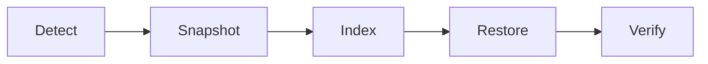

# game-save-manager-suite 🧩💾

  

*A calm, dependable home for every save file your library has ever produced.*

  

---

## 🗂️ What This Is NOT

Before anything else, a clarification, because the name invites assumptions.

This is **not** a cloud storage reseller, a Steam Cloud replacement, or a background service that silently phones home with your data. It does not modify save contents, edit game memory, or touch anything inside a running game process. It has no relationship to trainers, mods, or anything that alters gameplay logic — it only ever reads and copies the files your games already write to disk.

What it **is**: a focused, local-first save manager for Windows. It watches known save-data locations, snapshots them on a schedule or on demand, and gives you a clean timeline to step back through. Think of it less as a tool and more as an insurance policy that lives quietly in your system tray.

---

## 🔭 Overview

Every player who has logged a few hundred hours across a library eventually hits the same wall: a corrupted save, an accidental overwrite, a cloud sync conflict that picked the wrong version, or a mid-game character wipe with no warning. Save data is scattered across `%APPDATA%`, `Documents`, `%LOCALAPPDATA%`, and half a dozen vendor-specific folders, each game inventing its own convention. There has never been a consistent, trustworthy layer sitting underneath all of it — until now.

**game-save-manager-suite** exists to be that layer. It is a Windows-native game save manager built around three ideas: saves should be versioned like code, backups should be automatic rather than remembered, and restoring progress should never require digging through folder trees at 1am after a crash. The suite indexes your installed games, tracks the folders and files that matter, and maintains a rolling history so that "undo" becomes something you can apply to your entire gaming life, not just your last keystroke.

It is built for the completionist replaying a 100-hour RPG who cannot afford to lose a branching save, for the speedrunner who resets constantly and needs instant rollbacks, for the modder whose save files break more often than they'd like to admit, and for the ordinary player who just wants peace of mind. If you have ever whispered "please tell me I have a backup of that" — this is written for you.

  

---

## 🧭 What It Actually Does

> [!NOTE]
> The list below describes capabilities, not marketing copy. Each one maps to a real, tested code path in the suite.

- **Automatic save-path discovery** — a curated detection engine recognizes hundreds of common save-data locations across launchers and engines, so you rarely need to point it anywhere manually.

- **Scheduled snapshotting** — define an interval (per game, or globally) and let the suite quietly capture save states in the background without interrupting play.

- **Version timeline, not just a backup folder** — every snapshot is a labeled point in time you can browse, compare, and roll back to, rather than a flat pile of `.zip` files with cryptic timestamps.

- **One-click restore** — pick a point in history and the suite restores exactly those files, in exactly that state, with the current save quietly preserved as a safety copy first.

- **Multi-slot profile management** — maintain separate save profiles for the same game (different playthroughs, different family members, different experiments) without them colliding.

- **Integrity verification** — snapshots are checksummed on capture, so silent corruption during backup is detected rather than discovered three weeks later.

- **Portable export** — package a game's save history into a single archive you can move to another machine, useful when upgrading hardware or reinstalling Windows.

- **Low-footprint background operation** — the monitoring process is deliberately lightweight; it is designed to never compete with your game for CPU or disk I/O during active play.

> [!TIP]
> Pair scheduled snapshotting with the "pre-launch capture" setting so that every session starts with a guaranteed restore point, even if you forget to do anything yourself.

---

## 🚀 How To Get Started

1. **Visit the landing page** using the download button above or below — this is the only place official builds are distributed from.

2. **Download the latest release** for Windows 10 or 11. No installer chains, no bundled toolbars.

3. **Run the application.** It ships as a standalone executable — no separate runtime, framework, or package manager is required.

4. **Let it index your library.** On first launch, the suite scans common save-data directories and presents a review screen so you can confirm or adjust what gets tracked before anything is captured.

> [!IMPORTANT]
> Review the detected save paths on first run. Detection heuristics are broad but not omniscient — unusual install locations or heavily modded games may need a manual path added.

---

## 🖥️ System Requirements

| Requirement | Detail |
|---|---|
| Operating System | Windows 10 (64-bit) or Windows 11 |
| Dependencies | None — fully standalone, no external runtime required |
| Disk Space | Minimal for the application; snapshot storage scales with save size and retention settings |
| Permissions | Standard user account is sufficient for most games; a small subset of protected install paths may prompt for elevated access |
| Internet | Not required for core operation — all backup and restore logic runs locally |

  

---

## ⚙️ How It Works

The internal flow is intentionally simple, so that a save manager you're trusting with irreplaceable progress remains easy to reason about.

1. **Detection** — the suite locates a game's save directory using its detection ruleset or a manually specified path.

2. **Snapshot capture** — on a schedule, on launch, or on manual trigger, the current save state is copied into versioned, checksummed storage.

3. **Timeline indexing** — each snapshot is logged with a timestamp, game identifier, and integrity hash, forming a browsable history.

4. **Restore on demand** — selecting a point in the timeline restores those exact files, after first archiving the current state as a fallback.

5. **Housekeeping** — retention rules prune old snapshots according to your settings, keeping storage predictable over time.

> [!WARNING]
> Restoring a snapshot overwrites the current save on disk. The suite always keeps a pre-restore safety copy, but external tools writing to the same folder at the same moment can still cause conflicts — close the game before restoring.

---

## 🧩 Troubleshooting

<strong>My game isn't detected automatically — what now?</strong>

Add its save folder manually from the "Tracked Games" panel. Detection rules cover a wide range of common engines and launchers, but obscure or self-published titles sometimes need a manual pointer.

<strong>A restore didn't seem to change anything in-game.</strong>

Most games only read save data on launch or on a specific load screen. Fully quit and relaunch the game after restoring, rather than reloading from a pause menu.

<strong>Snapshots are consuming more disk space than expected.</strong>

Adjust retention settings under Preferences → Storage. Reducing snapshot frequency or history depth for large-save games (open-world titles especially) resolves most cases.

<strong>The suite flagged a snapshot as corrupted.</strong>

This means the checksum captured at backup time no longer matches the stored file — typically caused by an interrupted write during capture. Roll back to the nearest earlier snapshot; the flagged one is intentionally not offered for restore.

<strong>Can I use this alongside a platform's own cloud sync?</strong>

Yes, but treat this suite as the authoritative local history and the cloud sync as a secondary layer. Restoring locally and then letting cloud sync push that state upward is the safest order of operations.

<strong>Does it work with saves stored inside a game's install folder rather than AppData?</strong>

Yes — any accessible directory can be tracked manually, regardless of whether it sits under Program Files, a custom install drive, or a portable game folder.

---

## 🎨 Interface, Shortcuts & Personalization

The interface favors clarity over density — a save manager should never feel harder to navigate than the games it protects.

- **Themes** — Light, Dark, and a high-contrast mode for accessibility, switchable instantly without a restart.

- **Keyboard shortcuts**:

  | Action | Shortcut |
  |---|---|
  | Manual snapshot | `Ctrl + S` |
  | Open restore timeline | `Ctrl + R` |
  | Search tracked games | `Ctrl + F` |
  | Toggle background monitoring | `Ctrl + Shift + M` |
  | Open settings | `Ctrl + ,` |

- **Compact tray mode** — minimizes to the system tray and keeps snapshotting active without a visible window.

- **Notification granularity** — choose between silent, minimal, or verbose notifications for capture and restore events.

> [!TIP]
> Verbose notifications are useful the first week, while you build trust in the schedule — most users switch to minimal once the rhythm feels reliable.

---

## 🤝 Contributing & Community

Contributions, issue reports, and detection-rule submissions for additional games are welcome. If you maintain a game whose save location isn't recognized, a pull request adding its path pattern is one of the most valuable things you can contribute.

- Open an issue for bugs, with your Windows version and the affected game noted.

- Propose new detection rules via pull request — small, focused PRs are reviewed faster.

- Discussions are the right place for feature ideas before they become issues.

> [!NOTE]
> This project is maintained by volunteers in their spare time. Response times vary, but every issue is read.

---

## 📜 License

Released under the [MIT License](LICENSE), 2026. Use it, study it, adapt it — the license asks only for attribution in return.

---

## ⚠️ Disclaimer

This software is provided "as is," without warranty of any kind. It is an independent, community-built utility with no affiliation to any game publisher, platform, or launcher mentioned or detected by its scanning logic. Always maintain your own additional backups for save data of significant personal or sentimental value — no single tool should be your only line of defense against data loss.

  

